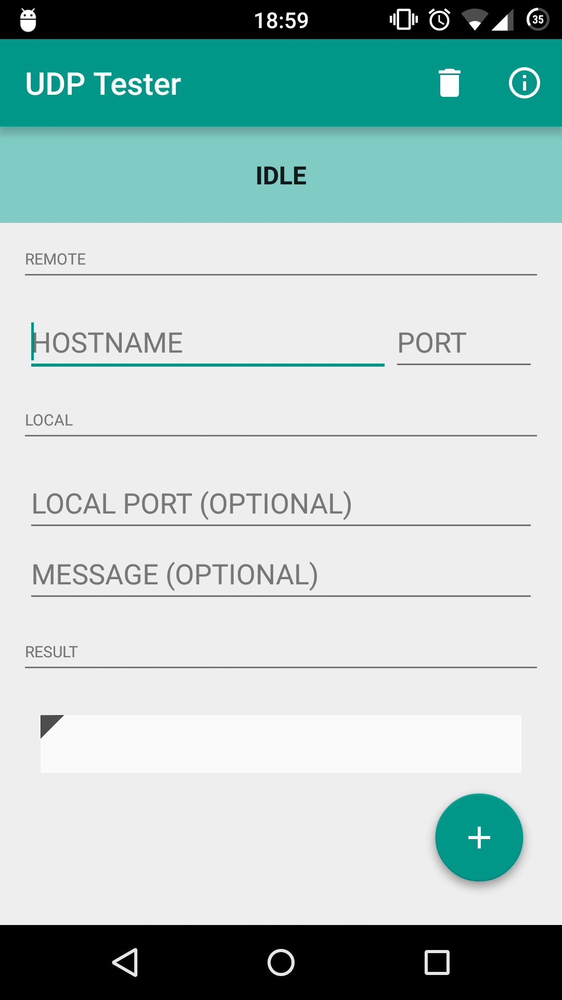
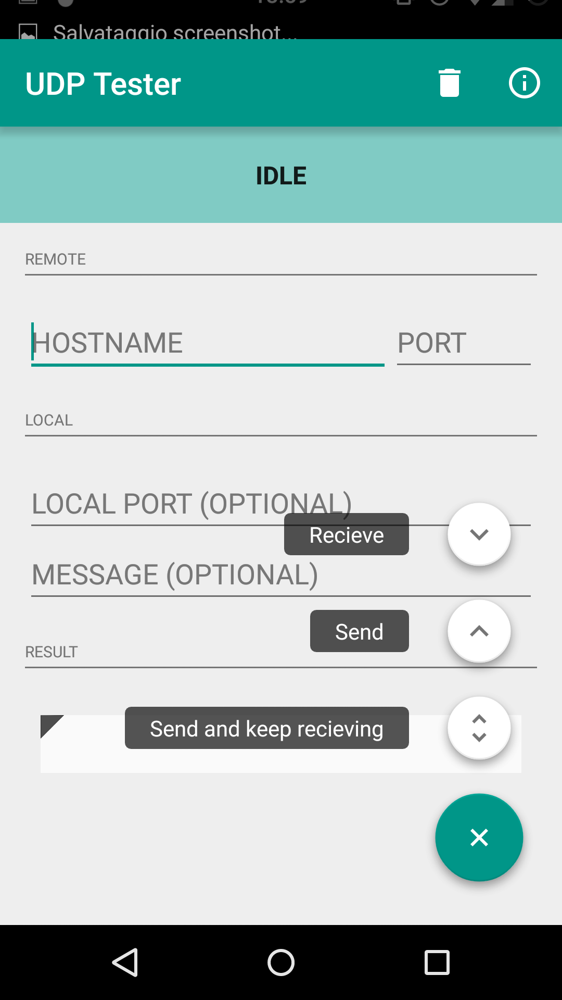
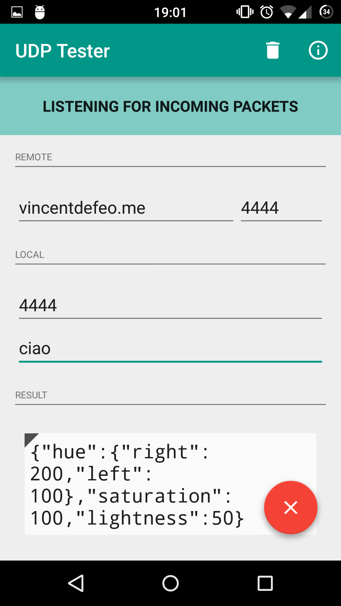
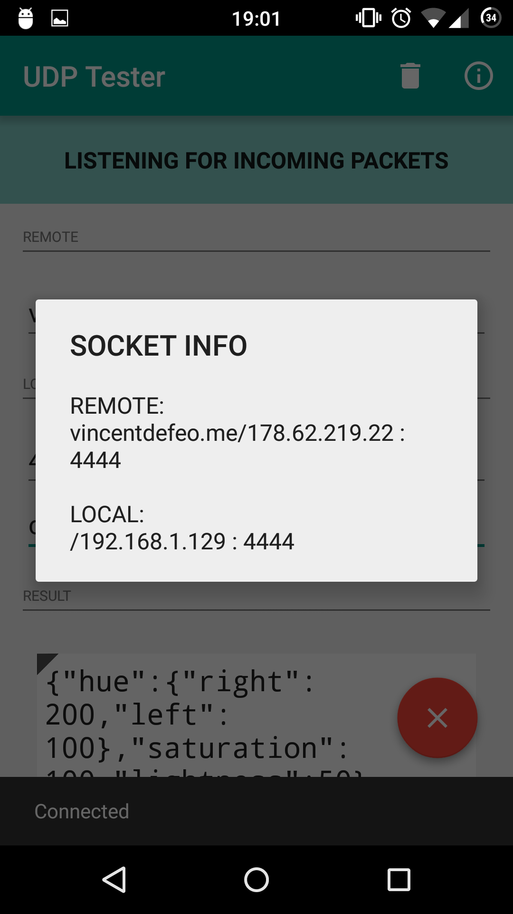
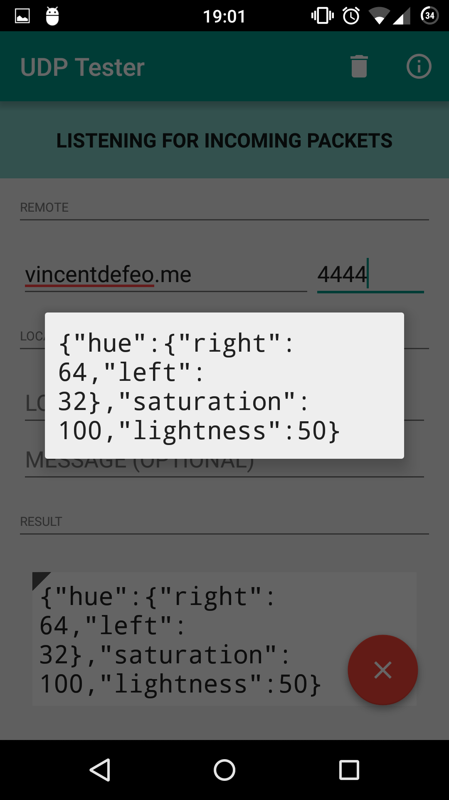

# UDP-Tester
Android app for testing UDP services with plain text messages

__Support:__ API 14+ (Android 4.0)

####Screenshots

####Libraries 
+ SnackBar: https://github.com/nispok/snackbar
+ FAB: https://github.com/futuresimple/android-floating-action-button/

####TODO: 

+ AutocompleteTextField for hostname

+ App Icon
